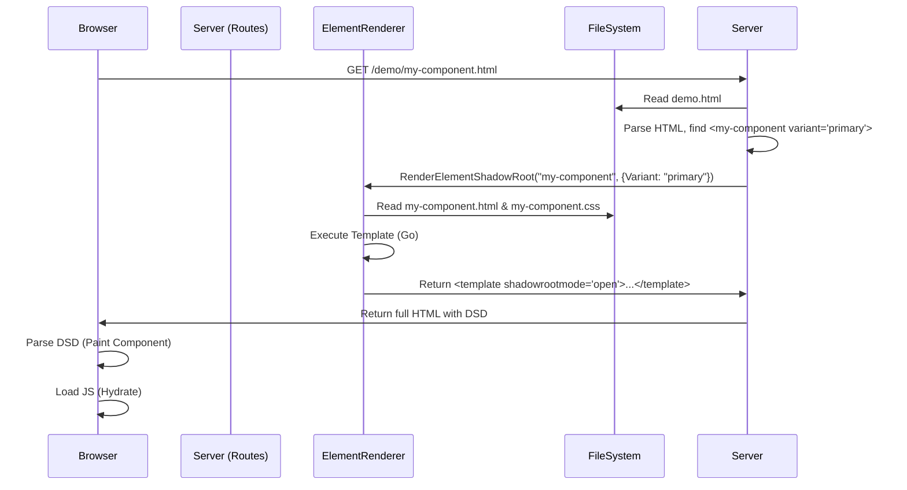
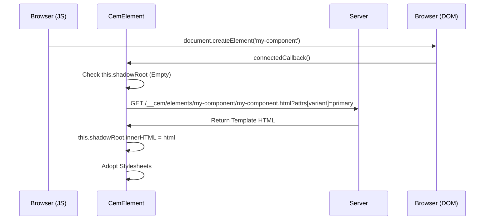

# Hybrid Rendering Architecture

This document outlines the "Hybrid Rendering" architecture used in the CEM development server (`serve` package). This architecture bridges the gap between Server-Side Rendering (SSR) for performance/SEO and Client-Side Rendering (CSR) for interactivity, using a **Single Source of Truth** for component templates.

## Core Concept

The core philosophy is that **Go HTML Templates** (`.html` files with `{{.}}` syntax) define the component structure.

1.  **SSR (Initial Load)**: The server executes these templates, injecting the result as Declarative Shadow DOM (`<template shadowrootmode="open">`). The browser parses this immediately, yielding a painted component before any JavaScript runs.
2.  **CSR (Hydration/Dynamic)**: If a component is created dynamically (via JS) or if the browser doesn't support DSD, the client-side base class (`CemElement`) fetches the *same* template from the server, applying it to the shadow root.

## Key Components

### 1. Server-Side: `routes.go` & `element.go`
*   **Role**: The Orchestrator and Renderer.
*   **Location**: `serve/middleware/routes/`
*   **Responsibility**:
    *   Intercepts requests for demo pages.
    *   Parses the demo HTML to find custom elements.
    *   **`RenderElementShadowRoot` (`element.go`)**: The critical function that loads a component's template, executes it with the specific attributes found in the demo HTML, and generates the `<template shadowrootmode="open">` block.
    *   Serves the component assets (HTML/CSS) via the `/__cem/elements/` endpoints for client-side access.

### 2. Component Definition: Templates
*   **Role**: The Single Source of Truth.
*   **Location**: `serve/middleware/routes/templates/elements/{tag}/{tag}.html`
*   **Format**: Standard HTML fragments using Go `text/template` syntax.
*   **Usage**:
    *   **Server**: Executed with a data context (e.g., `.Attributes.Variant`).
    *   **Client**: Served to the client (potentially transformed) to be used as `innerHTML`.

### 3. Client-Side: `CemElement` (`cem-element.js`)
*   **Role**: The Client-Side Base Class.
*   **Location**: `serve/middleware/routes/templates/js/cem-element.js`
*   **Responsibility**:
    *   Extends `HTMLElement`.
    *   **Hydration**: In `connectedCallback`, it checks if `this.shadowRoot` is already populated (by SSR).
    *   **Fallback**: If the shadow root is empty, it constructs a fetch request to the server (e.g., `/__cem/elements/my-el/my-el.html`) to get the template.
    *   **Caching**: Caches templates and stylesheets to minimize network requests for multiple instances of the same component.
    *   **Internals**: Manages `ElementInternals` for form participation and accessibility, bridging the gap between the SSR'd DOM and client-side state.

## Data Flow

### Flow 1: Initial Page Load (SSR)



### Flow 2: Client-Side Instantiation (CSR)



## Directory Structure

```text
serve/middleware/routes/
├── routes.go           # HTTP handler, serves /__cem/ endpoints
├── element.go          # SSR logic (RenderElementShadowRoot)
└── templates/
    └── elements/       # Component definitions
        └── pf-v6-button/
            ├── pf-v6-button.html  # The Template (Go syntax)
            ├── pf-v6-button.css   # Styles
            └── pf-v6-button.js    # Logic (extends CemElement)
```

## Benefits

1.  **Performance**: First Contentful Paint (FCP) includes the rendered component. No Layout Shift (CLS) waiting for JS to define the element.
2.  **Accessibility**: Shadow DOM content is available to the accessibility tree immediately (in modern browsers supporting DSD).
3.  **Developer Experience**: Developers write the template *once* in HTML. The system handles the complexity of making it work both on the server and the client.
