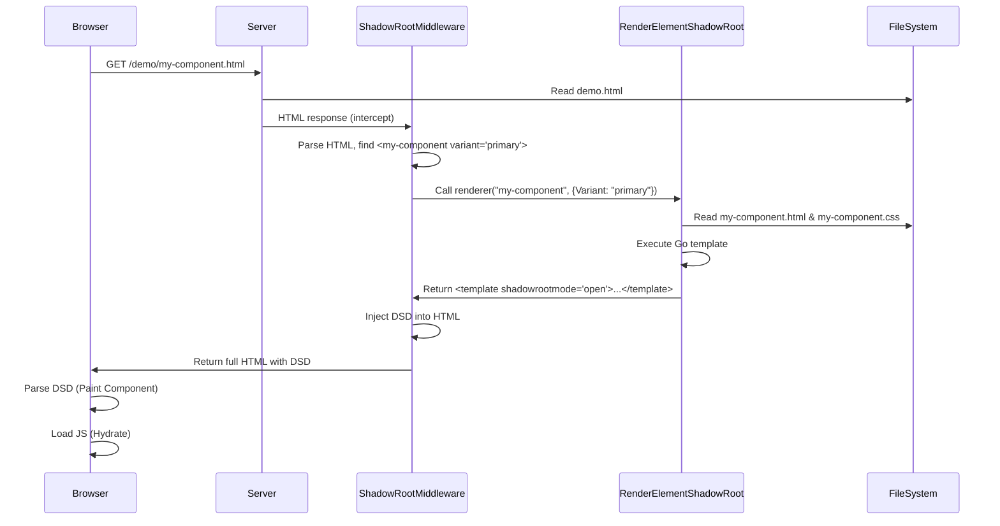
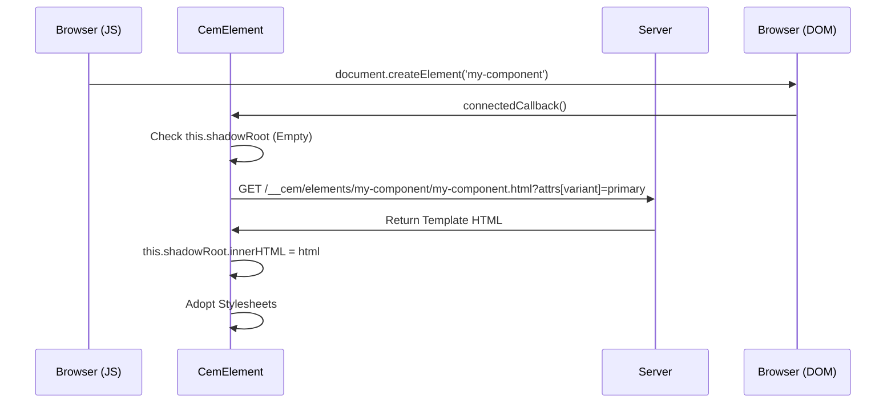
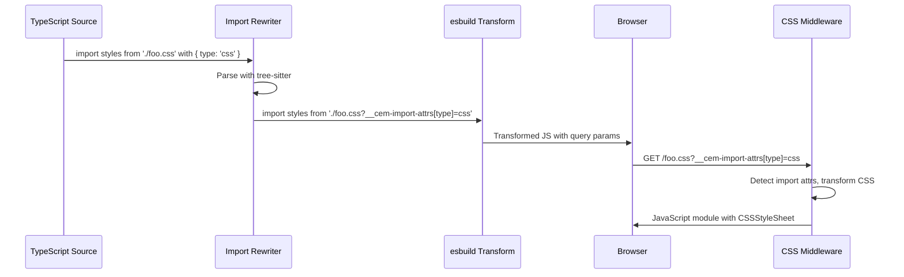

# Hybrid Rendering Architecture

This document outlines the "Hybrid Rendering" architecture used in the CEM development server (`serve` package). This architecture bridges the gap between Server-Side Rendering (SSR) for performance/SEO and Client-Side Rendering (CSR) for interactivity, using a **Single Source of Truth** for component templates.

## Core Concept

The core philosophy is that **Go HTML Templates** (`.html` files with `{{.}}` syntax) define the component structure.

1.  **SSR (Initial Load)**: The server executes these templates, injecting the result as Declarative Shadow DOM (`<template shadowrootmode="open">`). The browser parses this immediately, yielding a painted component before any JavaScript runs.
2.  **CSR (Hydration/Dynamic)**: If a component is created dynamically (via JS) or if the browser doesn't support DSD, the client-side base class (`CemElement`) fetches the *same* template from the server, applying it to the shadow root.

## Key Components

### 1. Server-Side: Shadow Root Middleware
*   **Role**: HTML Response Interceptor and SSR Orchestrator
*   **Location**: `serve/middleware/shadowroot/`
*   **Responsibility**:
  *   Intercepts all HTML responses from the server
  *   Parses HTML to find custom elements (elements with hyphens in tag names)
  *   For each known custom element, calls the renderer to inject Declarative Shadow DOM
  *   Recursively processes nested custom elements
  *   Wired up in `serve/server.go` with `routes.RenderElementShadowRoot` as the renderer function

### 2. Server-Side: Template Renderer
*   **Role**: Component Template Executor
*   **Location**: `serve/middleware/routes/element.go`
*   **Responsibility**:
  *   **`RenderElementShadowRoot`**: Loads a component's template and CSS, executes the template with attribute data, and generates the `<template shadowrootmode="open">...</template>` block
  *   Supports recursive rendering for nested custom elements via template functions
  *   Serves component assets (HTML/CSS) via the `/__cem/elements/` endpoints for client-side access

### 3. Component Definition: Templates
*   **Role**: The Single Source of Truth.
*   **Location**: `serve/middleware/routes/templates/elements/{tag}/{tag}.html`
*   **Format**: Standard HTML fragments using Go `text/template` syntax.
*   **Usage**:
  *   **Server**: Executed with a data context (e.g., `.Attributes.Variant`).
  *   **Client**: Served to the client (potentially transformed) to be used as `innerHTML`.

### 4. Client-Side: `CemElement` (`cem-element.js`)
*   **Role**: The Client-Side Base Class.
*   **Location**: `serve/middleware/routes/templates/js/cem-element.js`
*   **Responsibility**:
  *   Extends `HTMLElement`.
  *   **Hydration**: In `connectedCallback`, it checks if `this.shadowRoot` is already populated (by SSR).
  *   **Fallback**: If the shadow root is empty, it constructs a fetch request to the server (e.g., `/__cem/elements/my-el/my-el.html`) to get the template.
  *   **Caching**: Caches templates and stylesheets to minimize network requests for multiple instances of the same component.
  *   **Internals**: Manages `ElementInternals` for form participation and accessibility, bridging the gap between the SSR'd DOM and client-side state.

## Data Flow

### Flow 1: Initial Page Load (SSR)



### Flow 2: Client-Side Instantiation (CSR)



## Directory Structure

```text
serve/
├── server.go                    # Wires up middleware chain
├── middleware/
│   ├── shadowroot/
│   │   └── shadowroot.go        # HTML interceptor, SSR orchestrator
│   └── routes/
│       ├── routes.go            # HTTP handler, serves /__cem/ endpoints
│       ├── element.go           # Template renderer (RenderElementShadowRoot)
│       └── templates/
│           ├── js/
│           │   └── cem-element.js  # Client-side base class
│           └── elements/           # Component definitions
│               └── pf-v6-button/
│                   ├── pf-v6-button.html  # Shadow DOM template (Go syntax)
│                   ├── pf-v6-button.css   # Styles
│                   └── pf-v6-button.js    # Logic (extends CemElement)
```

## Middleware Chain

The server sets up a middleware chain in `server.go:1397` (applied in reverse order, so requests flow through them top-to-bottom):

1. **Routes** (`serve/middleware/routes/`) - Handles `/__cem/*` endpoints (demos, elements, manifest, WebSocket, etc.)
2. **TypeScript Transform** (`serve/middleware/transform/`) - Transpiles `.ts` files to JavaScript on-the-fly
3. **CSS Transform** (`serve/middleware/transform/`) - Transpiles CSS with `@import` resolution
4. **Import Map Injection** (`serve/middleware/importmap/`) - Generates and injects import maps into HTML
5. **WebSocket Injection** (`serve/middleware/inject/`) - Adds live reload client script to HTML
6. **Shadow Root Injection** (`serve/middleware/shadowroot/`) - **Intercepts HTML responses, parses them, and injects Declarative Shadow DOM for custom elements**
7. **Static Files** (terminal handler) - Serves files from the watch directory

**Key insight**: The shadowroot middleware is the final layer before HTML reaches the browser. This means:
- Demo HTML files are served by the static handler
- Import maps and WebSocket scripts are injected
- Finally, shadowroot middleware parses the complete HTML and adds `<template shadowrootmode="open">` blocks for all custom elements

This architecture ensures SSR happens transparently without modifying the original demo files.

## TypeScript and CSS Transformations

### Import Attributes Rewriting

**Location**: `serve/middleware/transform/import_rewrite.go`

The dev server supports standard [import attributes](https://github.com/tc39/proposal-import-attributes) syntax (e.g., `import styles from './foo.css' with { type: 'css' }`) despite esbuild's current limitation with this syntax.

**Implementation**:

1. **Tree-sitter Query** (`queries/typescript/importAttributes.scm`): Captures import statements with `with { ... }` attributes, extracting both the import path and all attribute key-value pairs.

2. **Pre-transform Rewriting** (`transform/engine.go:91-97`): Before esbuild processes TypeScript source:
   - `RewriteImportAttributes()` parses the source with tree-sitter
   - Detects imports with attributes
   - Rewrites paths to include query parameters: `'./foo.css' with { type: 'css' }` → `'./foo.css?__cem-import-attrs[type]=css'`
   - Falls back gracefully to original source if rewriting fails

3. **Server-side Handling** (`transform/css.go:156-172`): The CSS middleware:
   - Checks for `__cem-import-attrs` query parameters in requests
   - If present, transforms the CSS file to a JavaScript module (bypassing include/exclude patterns)
   - Returns a `CSSStyleSheet` object wrapped in a JavaScript module

**Data Flow**:



**Benefits**:
- Preserves standard import attributes syntax in source code
- Works around esbuild's current limitation
- Future-proof: supports any import attribute (not just `type: 'css'`)
- Explicit intent: import attributes bypass include/exclude glob patterns

## Benefits

1.  **Performance**: First Contentful Paint (FCP) includes the rendered component. No Layout Shift (CLS) waiting for JS to define the element.
2.  **Accessibility**: Shadow DOM content is available to the accessibility tree immediately (in modern browsers supporting DSD).
3.  **Developer Experience**: Developers write the template *once* in HTML. The system handles the complexity of making it work both on the server and the client.
